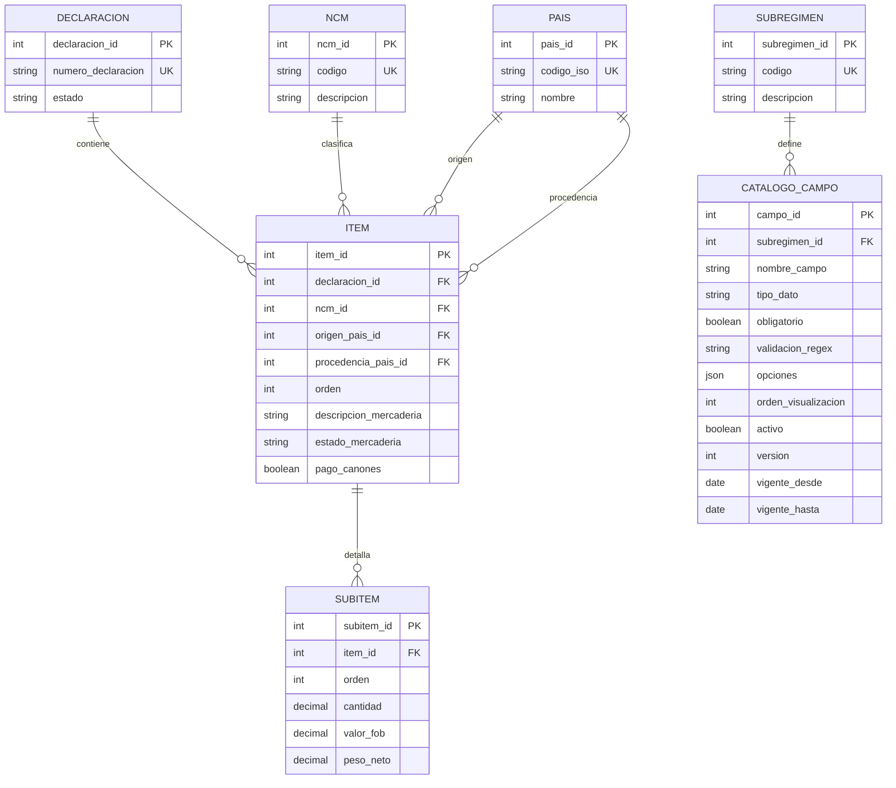

# D5 - Catálogo: Documentación del Modelo de Datos

**Última actualización**: 2025-11-07
**Estado**: Pendiente de implementación
**Módulo**: D5 - Catálogo de Mercaderías y NCM

## Descripción General

El módulo D5 (Catálogo) gestiona la información de mercaderías, productos y clasificaciones arancelarias necesarias para las declaraciones aduaneras. Este módulo es fundamental para el módulo D4 (Declaraciones), ya que proporciona los datos de referencia para los ítems y subítems de las operaciones IMEX.

## Responsabilidades del Módulo

- Gestión de mercaderías y productos
- Nomenclatura Común del Mercosur (NCM)
- Atributos y clasificaciones arancelarias
- Configuración dinámica de campos según subrégimen
- Validación de datos de mercaderías

## Modelo de Datos (DER)

### Entidades Principales

#### 1. NCM (Nomenclatura Común del Mercosur)

Tabla que almacena las posiciones arancelarias del Mercosur.

**Tabla**: `NCM`

| Campo | Tipo | Restricción | Descripción |
|-------|------|-------------|-------------|
| `ncm_id` | int | PK | Identificador único de la posición NCM |
| `codigo` | string | NOT NULL | Código de la posición arancelaria (ej: "8471.30.12") |
| `descripcion` | string | NOT NULL | Descripción de la posición arancelaria |

**Índices**:
- PK: `ncm_id`
- UNIQUE: `codigo`

**Notas**:
- El código NCM sigue el formato estándar del Mercosur (8-10 dígitos)
- La descripción debe ser clara y completa para facilitar la búsqueda

---

#### 2. ITEM

Tabla que representa un ítem (mercadería) dentro de una declaración aduanera.

**Tabla**: `ITEM`

| Campo | Tipo | Restricción | Descripción |
|-------|------|-------------|-------------|
| `item_id` | int | PK | Identificador único del ítem |
| `declaracion_id` | int | FK | Referencia a la declaración aduanera |
| `orden` | int | NOT NULL | Orden del ítem en la declaración |
| `ncm_id` | int | FK | Referencia a la posición arancelaria NCM |
| `origen_pais_id` | int | FK | País de origen de la mercadería |
| `procedencia_pais_id` | int | FK | País de procedencia de la mercadería |
| `descripcion_mercaderia` | string | NOT NULL | Descripción detallada de la mercadería |
| `estado_mercaderia` | string | NOT NULL | Estado de la mercadería (nuevo, usado, etc.) |
| `pago_canones` | boolean | NOT NULL | Indica si hay pago de cánones o regalías |

**Relaciones**:
- `declaracion_id` → `DECLARACION.declaracion_id` (N:1)
- `ncm_id` → `NCM.ncm_id` (N:1)
- `origen_pais_id` → `PAIS.pais_id` (N:1)
- `procedencia_pais_id` → `PAIS.pais_id` (N:1)

**Índices**:
- PK: `item_id`
- FK: `declaracion_id`, `ncm_id`, `origen_pais_id`, `procedencia_pais_id`
- INDEX: `(declaracion_id, orden)` para ordenamiento

**Reglas de Negocio**:
- El campo `orden` debe ser único dentro de una declaración
- La descripción de la mercadería debe ser suficientemente detallada para identificación
- El país de origen puede ser diferente al de procedencia

---

#### 3. SUBITEM

Tabla que representa el detalle de cada ítem (cantidades, valores, pesos).

**Tabla**: `SUBITEM`

| Campo | Tipo | Restricción | Descripción |
|-------|------|-------------|-------------|
| `subitem_id` | int | PK | Identificador único del subítem |
| `item_id` | int | FK | Referencia al ítem padre |
| `orden` | int | NOT NULL | Orden del subítem dentro del ítem |
| `cantidad` | decimal(15,4) | NOT NULL | Cantidad de mercadería |
| `valor_fob` | decimal(15,2) | NOT NULL | Valor FOB en USD |
| `peso_neto` | decimal(15,3) | NOT NULL | Peso neto en kilogramos |

**Relaciones**:
- `item_id` → `ITEM.item_id` (N:1)

**Índices**:
- PK: `subitem_id`
- FK: `item_id`
- INDEX: `(item_id, orden)` para ordenamiento

**Reglas de Negocio**:
- Un ítem puede tener múltiples subítems
- El campo `orden` debe ser único dentro de un ítem
- Los valores deben ser positivos
- El peso neto debe ser coherente con la cantidad

---

#### 4. CATALOGO_CAMPO

Tabla que define campos dinámicos según el subrégimen aduanero.

**Tabla**: `CATALOGO_CAMPO`

| Campo | Tipo | Restricción | Descripción |
|-------|------|-------------|-------------|
| `campo_id` | int | PK | Identificador único del campo |
| `subregimen_id` | int | FK | Referencia al subrégimen aduanero |
| `nombre_campo` | string | NOT NULL | Nombre técnico del campo |
| `tipo_dato` | string | NOT NULL | Tipo de dato (string, int, decimal, date, boolean) |
| `obligatorio` | boolean | NOT NULL | Indica si el campo es obligatorio |
| `validacion_regex` | string | NULL | Expresión regular para validación |
| `opciones` | json | NULL | Opciones para campos tipo select/radio |
| `orden_visualizacion` | int | NOT NULL | Orden de visualización en el formulario |
| `activo` | boolean | NOT NULL | Indica si el campo está activo |
| `version` | int | NOT NULL | Versión del campo para control de cambios |
| `vigente_desde` | date | NOT NULL | Fecha desde la cual el campo es vigente |
| `vigente_hasta` | date | NULL | Fecha hasta la cual el campo es vigente |

**Relaciones**:
- `subregimen_id` → `SUBREGIMEN.subregimen_id` (N:1)

**Índices**:
- PK: `campo_id`
- FK: `subregimen_id`
- INDEX: `(subregimen_id, activo, vigente_desde, vigente_hasta)` para consultas de vigencia

**Reglas de Negocio**:
- Los campos pueden variar según el subrégimen aduanero
- El campo `opciones` debe ser un JSON válido cuando `tipo_dato` sea "select" o "radio"
- La validación regex es opcional pero recomendada para campos de texto
- Los campos pueden tener múltiples versiones a lo largo del tiempo
- Solo puede haber una versión activa por campo en un período dado

**Ejemplo de JSON en `opciones`**:
```json
{
  "valores": [
    {"codigo": "N", "descripcion": "Nuevo"},
    {"codigo": "U", "descripcion": "Usado"}
  ]
}
```

---

### Entidades Relacionadas (Referenciadas)

#### PAIS

Tabla de referencia de países (gestionada por otro módulo).

| Campo | Tipo | Restricción | Descripción |
|-------|------|-------------|-------------|
| `pais_id` | int | PK | Identificador único del país |
| `codigo_iso` | string(3) | UNIQUE | Código ISO 3166-1 alpha-3 |
| `nombre` | string | NOT NULL | Nombre del país |

#### DECLARACION

Tabla principal de declaraciones aduaneras (módulo D4).

| Campo | Tipo | Restricción | Descripción |
|-------|------|-------------|-------------|
| `declaracion_id` | int | PK | Identificador único de la declaración |
| `numero_declaracion` | string | UNIQUE | Número oficial de la declaración |
| `estado` | string | NOT NULL | Estado actual de la declaración |

#### SUBREGIMEN

Tabla de subregímenes aduaneros (módulo D4).

| Campo | Tipo | Restricción | Descripción |
|-------|------|-------------|-------------|
| `subregimen_id` | int | PK | Identificador único del subrégimen |
| `codigo` | string | UNIQUE | Código del subrégimen |
| `descripcion` | string | NOT NULL | Descripción del subrégimen |

---

## Diagrama de Relaciones



---

## Dependencias con Otros Módulos

### D4 (Declaraciones) → D5 (Catálogo)

El módulo D4 depende de D5 para:
- Validar posiciones arancelarias (NCM)
- Obtener campos dinámicos según subrégimen
- Validar datos de mercaderías

### D5 (Catálogo) → D3 (Seguridad)

El módulo D5 utiliza D3 para:
- Control de acceso a funciones de administración del catálogo
- Auditoría de cambios en NCM y campos dinámicos

---

## Casos de Uso Principales

### 1. Búsqueda de Posición Arancelaria

**Actor**: Usuario declarante
**Flujo**:
1. Usuario ingresa código NCM o palabras clave
2. Sistema busca en tabla `NCM`
3. Sistema retorna posiciones coincidentes
4. Usuario selecciona la posición correcta

### 2. Carga de Ítem en Declaración

**Actor**: Usuario declarante
**Flujo**:
1. Usuario selecciona posición NCM
2. Sistema obtiene campos dinámicos de `CATALOGO_CAMPO` según subrégimen
3. Usuario completa datos del ítem
4. Sistema valida datos según reglas de `CATALOGO_CAMPO`
5. Sistema crea registro en `ITEM`

### 3. Detalle de Subítems

**Actor**: Usuario declarante
**Flujo**:
1. Usuario ingresa cantidades y valores para cada subítem
2. Sistema valida coherencia de datos
3. Sistema crea registros en `SUBITEM`
4. Sistema calcula totales del ítem

### 4. Administración de Campos Dinámicos

**Actor**: Administrador del sistema
**Flujo**:
1. Administrador define nuevo campo para un subrégimen
2. Sistema crea registro en `CATALOGO_CAMPO`
3. Sistema versiona el campo
4. Campo queda disponible para declaraciones del subrégimen

---

## Validaciones y Reglas de Negocio

### Validaciones de NCM

- El código NCM debe tener formato válido (8-10 dígitos)
- No puede haber códigos NCM duplicados
- La descripción no puede estar vacía

### Validaciones de ITEM

- Debe existir la declaración referenciada
- Debe existir el código NCM referenciado
- El orden debe ser único dentro de la declaración
- La descripción de mercadería debe tener al menos 10 caracteres
- Los países de origen y procedencia deben existir

### Validaciones de SUBITEM

- Debe existir el ítem referenciado
- El orden debe ser único dentro del ítem
- Cantidad, valor FOB y peso neto deben ser mayores a cero
- El valor FOB debe estar en USD

### Validaciones de CATALOGO_CAMPO

- El nombre del campo debe ser único por subrégimen y versión
- El tipo de dato debe ser válido
- Si el campo es obligatorio, debe tener validación
- Las fechas de vigencia no pueden solaparse para el mismo campo
- El JSON de opciones debe ser válido

---

## Consideraciones de Implementación

### Performance

- Índices en campos de búsqueda frecuente (código NCM, descripción)
- Caché de campos dinámicos por subrégimen
- Paginación en búsquedas de NCM

### Seguridad

- Solo administradores pueden modificar tabla NCM
- Solo administradores pueden gestionar CATALOGO_CAMPO
- Auditoría de todos los cambios en catálogos

### Integraciones

- Sincronización periódica con base de datos oficial de NCM de ARCA
- Validación de NCM con KIT Malvina/Maria
- Exportación de datos para reportes

---

## Estado de Implementación

**Módulo D5**: Pendiente de análisis e implementación

**Bloqueantes identificados**:
- Definir fuente oficial de datos de NCM
- Especificar reglas de validación por subrégimen
- Definir proceso de actualización de catálogos

**Próximos pasos**:
1. Análisis detallado de requisitos con VUCE/DGA
2. Definición de historias de usuario
3. Desglose técnico de tareas
4. Implementación de modelo de datos
5. Desarrollo de APIs de consulta
6. Integración con módulo D4

---

## Referencias

- **Documento de Arquitectura VUCE-SIDOM**: Borrador v3 (Google Drive SIDOM)
- **Modelo de datos DrawIO**: `util/llm-docs-proyect/VUCE-Modelo de datos.drawio.xml` (512K)
- **Diagramas de flujos**: `util/llm-docs-proyect/graficos.drawio.xml` (597K - actualizado 2025-11-06)
- **Arquitectura completa**: `util/vuce-sidom-architecture.md`
- **Estado del proyecto**: `util/project-status.md`
- **Documentación privada completa**: `util/llm-docs-proyect/README.md` (métricas actualizadas)

---

## Resumen Ejecutivo

El módulo D5 (Catálogo) es el repositorio central de información arancelaria y de mercaderías del sistema VUCE-SIDOM DAI. Proporciona:

**Entidades Core**:
- **NCM**: 3 campos (id, código, descripción) - Base de datos de posiciones arancelarias
- **ITEM**: 9 campos - Mercaderías en declaraciones con NCM, países y descripción
- **SUBITEM**: 6 campos - Detalle de cantidades, valores FOB y pesos
- **CATALOGO_CAMPO**: 12 campos - Configuración dinámica de campos por subrégimen con versionado

**Características Clave**:
- Campos dinámicos configurables por subrégimen aduanero
- Versionado de configuraciones de campos
- Validaciones mediante regex y opciones JSON
- Soporte para múltiples países (origen vs procedencia)
- Integración con KIT Malvina para validación de NCM

**Dependencias**:
- D4 (Declaraciones) consume D5 para validar mercaderías
- D3 (Seguridad) controla acceso a administración del catálogo
- KIT Malvina valida posiciones arancelarias

**Estado**: Modelo de datos documentado y verificado contra DER. Pendiente de implementación.
