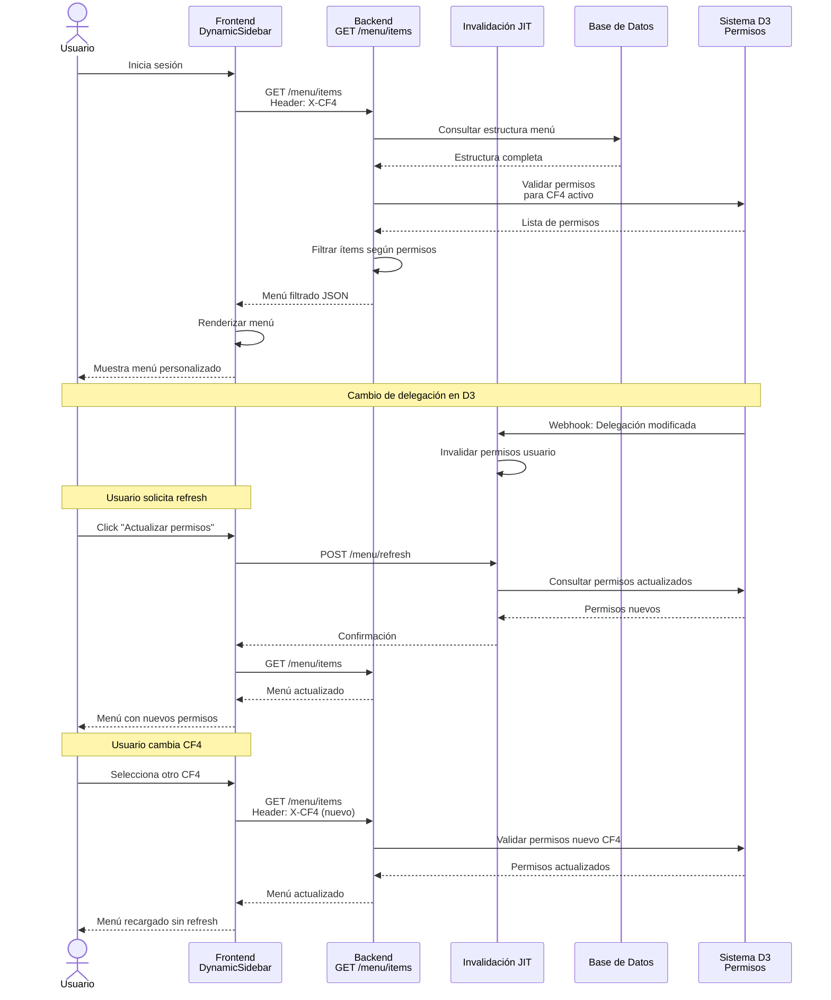
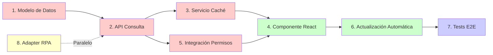

# Ejemplo de Desglose de Tareas

Este documento es un **ejemplo real** de cómo desglosar una historia de usuario en tareas técnicas implementables.

**Basado en**: HU #129 - Menú Lateral Dinámico
**Taiga US**: #129 (ID: 88)
**Estado**: ✅ Implementado con 8 tareas creadas

---

# Desglose de Tareas - HU #129: Menú Lateral Dinámico

**Historia de Usuario**: Generación dinámica del menú lateral
**Taiga US**: #129 (ID: 88)
**Prioridad**: Alta
**Módulo**: Navegación

## Descripción de la Historia

Como usuario autenticado, quiero visualizar un menú lateral adaptado a mi rol y permisos, para acceder únicamente a funcionalidades habilitadas.

### Contexto: CF4 y Delegaciones

**CF4**: CUIT de la organización que el usuario está representando.

El usuario puede ser:
- **Owner**: Dueño de la organización (su propio CUIT = CF4)
- **Delegado**: Administrador delegado por el owner de otra organización

El menú se filtra según:
1. CF4 activo (organización representada)
2. Rol del usuario en esa organización
3. Permisos específicos delegados

## Arquitectura de Componentes

```mermaid
graph TB
    subgraph Frontend
        A[Componente React<br/>DynamicSidebar]
        B[Hook useDynamicMenu]
        C[Selector CF4]
    end

    subgraph Backend
        D[API GET /menu/items]
        E[Invalidación JIT<br/>POST /menu/refresh]
        F[Modelo de Datos<br/>menu_items]
        G[Integración Permisos<br/>D3]
    end

    subgraph "Sistema D3"
        H[Permisos y Roles]
        I[Delegaciones CF4]
    end

    subgraph "Adapter RPA"
        J[RabbitMQ]
        K[Adapter .NET]
        L[KIT Malvina]
    end

    A -->|Consume| D
    B -->|Gestiona estado| A
    C -->|Cambia CF4| B
    C -->|Refresh permisos| E
    D -->|Consulta| F
    D -->|Valida| G
    E -->|Invalida caché| D
    G -->|Consulta| H
    G -->|Valida| I
    H -.->|Webhook cambios| E
    I -.->|Webhook cambios| E

    D -.->|Futuro| J
    J -.->|Procesa| K
    K -.->|Automatiza| L

    style A fill:#e1f5ff
    style D fill:#fff4e1
    style F fill:#ffe1e1
    style J fill:#f0e1ff
    style L fill:#ffe1f0
```



## Flujo de Uso



## Diagrama de Tareas



**Leyenda:**
- 🔴 Backend
- 🟢 Frontend
- 🔵 Testing
- 🟡 Integración (paralelo)

## Tareas Propuestas

### 1. Modelo de datos de configuración de menú

**Componente**: Backend - Base de datos

**Descripción**:
Crear modelo de datos para almacenar la estructura del menú y su relación con permisos.

**Criterios de aceptación**:
- Tabla `menu_items` con campos: id, código, label, icono, ruta, orden, parent_id, activo
- Tabla `menu_item_permissions` relacionando ítems con permisos requeridos
- Soporte para menú jerárquico (ítems padre e hijos)
- Datos de ejemplo cargados para testing
- Migraciones de base de datos creadas

**Dependencias**: Sistema de permisos D3

---

### 2. API de consulta de menú según permisos

**Componente**: Backend - API

**Descripción**:
Endpoint que retorna la estructura del menú filtrada según el rol y permisos del usuario autenticado.

**Criterios de aceptación**:
- Endpoint `GET /menu/items`
- Recibe CF4 activo en header `X-CF4`
- Valida token JWT de ARCA
- Filtra ítems según permisos del usuario para el CF4
- Retorna estructura jerárquica en JSON
- Incluye flag `enabled` para ítems sin permiso (mostrar deshabilitados)
- Tests unitarios y de integración

**Estructura de respuesta**:
```json
{
  "cf4": "30-12345678-9",
  "role": "REGISTRADOR",
  "menu_items": [
    {
      "id": "dashboard",
      "label": "Dashboard",
      "icon": "dashboard",
      "route": "/dashboard",
      "enabled": true,
      "order": 1
    },
    {
      "id": "operations",
      "label": "Operaciones",
      "icon": "assignment",
      "route": "/operations",
      "enabled": true,
      "order": 2,
      "children": [
        {
          "id": "operations-create",
          "label": "Crear Operación",
          "route": "/operations/create",
          "enabled": true
        }
      ]
    }
  ]
}
```


---

### 3. Invalidación JIT de permisos y actualización de menú

**Componente**: Backend - Servicio


**Descripción**:
Implementar servicio de invalidación Just-In-Time de permisos cuando el usuario solicita refresh o cuando cambian sus delegaciones/roles.

**Criterios de aceptación**:
- Endpoint `POST /menu/refresh` para forzar recarga de permisos
- Invalidación automática cuando cambian delegaciones en D3
- Invalidación automática cuando cambian roles del usuario
- Webhook desde D3 para notificar cambios de permisos
- Caché opcional con TTL corto (5 min) para performance
- Logs de invalidaciones con timestamp y motivo
- Tests de invalidación por cambio de delegación/rol


---

### 4. Componente React de menú lateral dinámico

**Componente**: Frontend - UI


**Descripción**:
Componente de menú lateral que se renderiza dinámicamente según la respuesta del backend.

**Criterios de aceptación**:
- Componente `<DynamicSidebar />` en React
- Consume endpoint `GET /menu/items`
- Renderiza estructura jerárquica con Material-UI
- Ítems deshabilitados muestran ícono de candado y tooltip explicativo
- Navegación con React Router
- Responsive (colapsa en mobile)
- Animaciones suaves de apertura/cierre
- Accesibilidad WCAG AA (navegación por teclado, ARIA labels)
- Tests con React Testing Library


---

### 5. Integración con sistema de permisos

**Componente**: Backend - Integración


**Descripción**:
Integrar el servicio de menú con el sistema de permisos y roles del módulo D3.

**Criterios de aceptación**:
- Consulta de permisos del usuario desde D3
- Validación de CF4 activo y delegaciones
- Resolución de permisos por rol (Administrador, Oficializador, Registrador, Visualizador)
- Manejo de múltiples delegaciones
- Logs de auditoría de accesos denegados
- Tests de integración con D3


---

### 6. Actualización automática del menú al cambiar contexto

**Componente**: Frontend - Estado


**Descripción**:
Implementar lógica para recargar el menú automáticamente cuando cambia el CF4 activo.

**Criterios de aceptación**:
- Hook personalizado `useDynamicMenu(cf4)`
- Recarga automática al cambiar CF4 sin refresh de página
- Indicador visual de carga durante actualización
- Manejo de errores con mensaje al usuario
- Caché local del menú por CF4
- Tests de cambio de contexto


---

### 7. Tests end-to-end de navegación

**Componente**: Testing - E2E


**Descripción**:
Tests automatizados del flujo completo de navegación con diferentes roles.

**Criterios de aceptación**:
- Tests con Cypress o Playwright
- Escenarios por rol: Administrador, Oficializador, Registrador, Visualizador
- Validación de ítems visibles/ocultos según permisos
- Test de cambio de CF4 y actualización de menú
- Test de navegación por teclado
- Test de accesibilidad
- Cobertura mínima 80%

**Dependencias**: Todas las tareas anteriores

---

## Tarea Adicional: Integración con Adapter RPA del KIT

### 8. Diseño de integración con Adapter RPA para KIT Malvina

**Componente**: Backend - Integración


**Descripción**:
Diseñar e implementar la capa de integración con el Adapter RPA (.NET) que automatiza el KIT Malvina en VM Windows.

**Criterios de aceptación**:
- Definir estructura de mensajes para RabbitMQ
- Especificar formato de requests al Adapter (JSON)
- Especificar formato de responses del Adapter (JSON)
- Definir endpoint de webhook para recibir respuestas
- Implementar cliente de RabbitMQ para envío de mensajes
- Implementar endpoint POST /webhooks/adapter para recibir respuestas
- Manejo de timeouts (máximo 30 segundos)
- Sistema de reintentos (máximo 3 intentos)
- Logs detallados de comunicación
- Documentación de protocolo de integración
- Tests con mock del Adapter

**Estructura de mensaje propuesta**:
```json
{
  "request_id": "uuid-v4",
  "operation_id": "DAI-2025-001234",
  "action": "validate_ncm" | "calculate_tributes" | "validate_manifest",
  "timestamp": "2025-11-07T12:00:00Z",
  "data": {
    "ncm_code": "8471.30.12",
    "origin_country": "CN",
    "fob_value": 10000.00
  },
  "callback_url": "https://dai.vuce.gob.ar/webhooks/adapter"
}
```

**Estructura de respuesta propuesta**:
```json
{
  "request_id": "uuid-v4",
  "operation_id": "DAI-2025-001234",
  "status": "success" | "error" | "pending_input",
  "timestamp": "2025-11-07T12:00:30Z",
  "result": {
    "validated": true,
    "tributes": [...],
    "questions": [...]
  },
  "error": null
}
```

**Dependencias**: Ninguna (puede desarrollarse en paralelo)

**Nota**: Esta tarea NO bloquea el desarrollo del menú lateral. Puede trabajarse en paralelo y es prerequisito para las HU de validaciones (#27, #28).

---

## Resumen

**Total de tareas**: 8
**Tareas de backend**: 5
**Tareas de frontend**: 2
**Tareas de testing**: 1

**Orden de implementación sugerido**:
1. Tarea 1 (Modelo de datos)
2. Tarea 2 (API)
3. Tarea 8 (Adapter RPA) - En paralelo
4. Tarea 3 (Caché)
5. Tarea 5 (Integración permisos)
6. Tarea 4 (Componente React)
7. Tarea 6 (Actualización automática)
8. Tarea 7 (Tests E2E)

**Bloqueantes**:
- Sistema de permisos D3 debe estar funcional
- Para tarea 6: requiere HU #130 (Actualización contextual)

**Notas**:
- La tarea 8 (Adapter RPA) es independiente y puede desarrollarse en paralelo
- El menú puede funcionar sin la integración del Adapter
- La integración del Adapter desbloquea las HU de validaciones futuras
