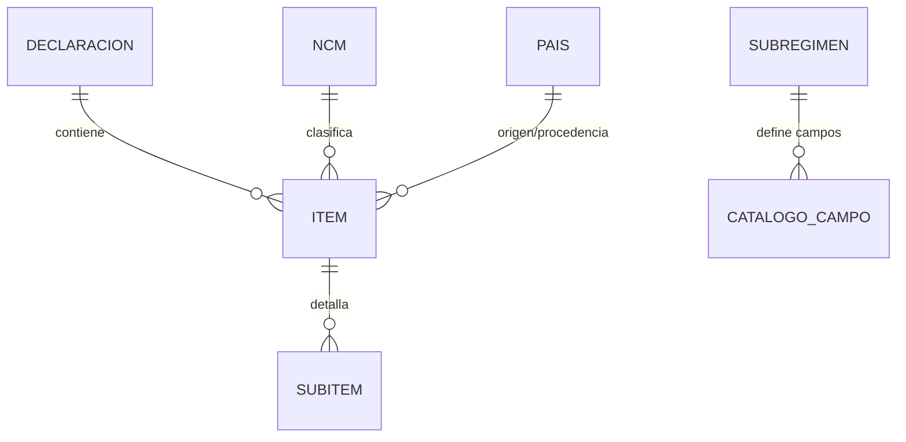

# Arquitectura VUCE-SIDOM DAI

## Visión General

Sistema de digitalización de declaraciones aduaneras para Argentina (BID 3869/OC-AR).

**Proyecto en Taiga**: DAI - Declaración Aduanera Integral
**Slug**: `dai-declaracion-aduanera-integral`
**ID**: 3

## Stack Tecnológico

### Frontend
- **Framework**: NextJS 15 + React 18
- **UI**: Material-UI
- **Renderizado**: Híbrido (SSR/SPA)

### Backend
- **Framework**: FastAPI (Python 3.11+)
- **ORM**: SQLAlchemy
- **Base de datos**: MySQL 8.0 (Primary + Replica)
- **Message Broker**: RabbitMQ

### Adapter
- **Tecnología**: .NET C# (x86)
- **Propósito**: Automatizar KIT Malvina (sistema legacy 32-bit)
- **Despliegue**: Múltiples VMs Windows para escalabilidad

## Arquitectura de Módulos

### D3 - Seguridad y Usuarios

**Responsabilidades:**
- Autenticación vía Clave Fiscal ARCA
- Gestión de usuarios y sesiones
- Sistema de roles y permisos
- Delegaciones empresariales (CF4)

**Modelo de Datos:**
```
IdP_Provider → Usuario → Sesión
                  ↓
            Usuario_Rol → Rol → Rol_Permiso → Permiso
                  ↓
             Delegación
                  ↓
          AuditoriaAcceso
```

**Conceptos Clave:**
- **CF4**: CUIT de la empresa representada (no el CUIT del usuario)
- **Delegación**: Autorización para operar en nombre de una empresa
- **Delegación Activa**: CF4 seleccionado en la sesión actual

### D4 - Operaciones IMEX (DAI)

**Responsabilidades:**
- Creación y gestión de declaraciones aduaneras
- Flujo completo desde borrador hasta oficialización
- Validaciones con KIT Malvina
- Cálculo de tributos y generación de VEP

**Estado de Implementación en Taiga:**
- 5 historias con tareas definidas (16 tareas totales)
- 3 historias pendientes de desglose
- 1 historia faltante por crear
- Ver `util/llm-docs-proyect/taiga-hu-tasks-mapping.md` para detalle completo

**Flujo de Estados:**
```
Borrador → En Carga → Validando → Observada → Lista → Oficializada → Pagada
                         ↓
                     Rechazada
```

**Componentes Principales:**
- Dashboard con contadores por estado (HU #21 - 3 tareas)
- Notificaciones personales y operacionales (HU #127, #128 - 7 tareas)
- Gestión de operaciones manual (HU #23 - 3 tareas)
- Carga masiva desde TXT (HU #22 - 3 tareas)
- Pre-carátula y carátula (HU #125 - pendiente desglose)
- Menú lateral dinámico (HU #129 - pendiente desglose)
- Actualización contextual CF4 (HU #130 - pendiente desglose)
- Validaciones interactivas con KIT Malvina
- Liquidación y oficialización

### D5 - Catálogo

**Responsabilidades:**
- Gestión de mercaderías y productos
- Nomenclatura Común del Mercosur (NCM)
- Atributos y clasificaciones arancelarias
- Configuración dinámica de campos según subrégimen

**Modelo de Datos:**


**Entidades Principales:**
- **NCM**: Posiciones arancelarias del Mercosur (código + descripción)
- **ITEM**: Mercadería en la declaración con NCM, países, descripción y estado
- **SUBITEM**: Detalle de cantidades, valores FOB y pesos netos
- **CATALOGO_CAMPO**: Campos dinámicos por subrégimen con validaciones y versionado

**Documentación Completa**: Ver `util/d5-catalogo-documentacion.md`

### D6 - Búsqueda y Reportes

**Responsabilidades:**
- Indexación de operaciones
- Consultas guardadas
- Generación de reportes

### D7-D8 - Documentos

**Responsabilidades:**
- Gestión de LPCO (Licencias, Permisos, Certificados)
- Sobres digitales
- Adjuntos y documentación
- Firma digital

## Integraciones Externas

### KIT Malvina/Maria

**Descripción**: Sistema legacy de la Dirección General de Aduanas para validaciones arancelarias y cálculo de tributos.

**Características:**
- Aplicación 32-bit Windows
- Requiere automatización vía Adapter .NET
- Motor de cálculo de tributos aduaneros

**⚠️ Información Pendiente:**
- Protocolo de comunicación detallado
- Endpoints y formato de datos
- Estructura de requests/responses
- Manejo de errores y timeouts

**Comunicación:**
```
Backend FastAPI → RabbitMQ → Adapter .NET → KIT Malvina
                                              ↓
Backend FastAPI ← Webhook ← Adapter .NET ← Respuesta
```

### VUCE Central

**Descripción**: Sistema central de Ventanilla Única de Comercio Exterior.

**Responsabilidades:**
- Coordinación entre organismos
- Notificaciones interorganismos
- Sincronización de estados

### TAD (ARCA)

**Descripción**: Sistema de ARCA para temas tributarios.

**Responsabilidades:**
- Validación de datos fiscales
- Integración con sistemas tributarios

### ARCA AFIP

**Descripción**: Autenticación mediante Clave Fiscal.

**Responsabilidades:**
- Identity Provider (IdP)
- Autenticación de usuarios
- Validación de CUIT/CUIL

## Patrones de Comunicación

### Sincrónico (Request/Response)
- Frontend ↔ Backend: REST API
- Backend ↔ MySQL: Queries SQL
- Backend ↔ Sistemas externos: HTTP/REST

### Asincrónico (Message Queue)
- Backend → Adapter: RabbitMQ
- Adapter → Backend: Webhooks

### Tiempo Real (Server-Sent Events)
- Backend → Frontend: SSE para notificaciones

## Requisitos No Funcionales

### Performance
- Tiempo de respuesta API: 1.5-3 segundos máximo
- Soporte para múltiples Adapters concurrentes
- Replicación de base de datos para lectura

### Seguridad
- Autenticación JWT de ARCA
- Validación de CF4 en cada request
- Auditoría completa de acciones
- Sin credenciales en código

### Accesibilidad
- Cumplimiento WCAG nivel AA
- Interfaz responsive
- Soporte para lectores de pantalla

### Auditoría
- Registro de quién, qué y cuándo
- Trazabilidad completa de operaciones
- Logs estructurados

## Bloqueantes Identificados

Estos puntos requieren definición con VUCE/DGA:

1. **KIT Maria - Acceso a datos**
   - Protocolo de comunicación
   - Estructura de datos
   - Endpoints disponibles
   - Manejo de errores

2. **Catálogo de eventos**
   - Tipos de notificaciones
   - Orígenes y prioridades
   - Formato de mensajes

3. **Transición de estados**
   - Diagrama completo
   - Condiciones de cambio
   - Validaciones por estado

4. **Matriz de permisos**
   - Roles disponibles
   - Acciones por rol
   - Restricciones por módulo

5. **Retención de datos**
   - Política de archivado
   - Períodos legales
   - Eliminación de datos

## Referencias

- **Documento de Arquitectura de Software**: Borrador v3 (Google Drive SIDOM)
- **Historias de Usuario D4**: 16 HU, 102 tareas (ver `util/llm-docs-proyect/README.md`)
- **Diagramas DrawIO**:
  - Flujos y estados: `util/llm-docs-proyect/graficos.drawio.xml` (597K)
  - Modelo de datos: `util/llm-docs-proyect/VUCE-Modelo de datos.drawio.xml` (512K)
- **TASKs D3**: Ejemplo de desglose técnico (Google Drive SIDOM)
- **Documentación D5 (Catálogo)**: `util/d5-catalogo-documentacion.md`
- **Integración KIT Malvina**: `util/kit-maria-integration.md`
- **Estado del proyecto**: `util/project-status.md`
